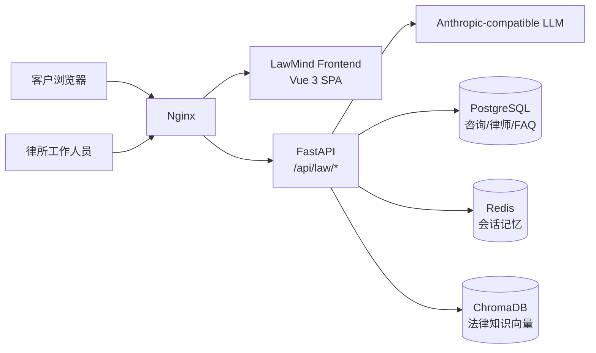

# LawMind

LawMind 是面向中国大陆律所对外咨询场景的 Python 多 Agent 智能法律咨询系统。系统帮助客户快速梳理法律问题，提供初步法律信息与风险提示，并通过留资、预约和人工升级流程衔接律所工作人员。

> 提示：AI 输出仅为一般性法律信息，不构成正式法律意见，也不替代执业律师对具体案件的判断。
> 完整架构说明见 [docs/architecture.md](docs/architecture.md)。
> Wiki：项目定位、技术亮点、业务流程、使用指南、学习文档和面试表达见 [wiki/README.md](wiki/README.md)。

## 功能

- 法律问题智能咨询
- 7 类个人法律领域识别：醉驾/危险驾驶、刑事辩护、劳动争议、婚姻家事、合同纠纷、交通事故、民间借贷
- 预约律师、律所服务咨询、暂不明确领域的兜底处理
- AI 初步风险分析和缺失关键事实追问
- 律师推荐与律师管理
- 客户留资、预约、转人工
- 咨询记录管理（PostgreSQL）
- FAQ 管理及 ChromaDB 向量同步
- 内置 69 条 FAQ，含 20 条经官方来源核对的醉驾、刑事程序及行政处罚法律依据
- 律所工作人员控制台（管理员密码保护）
- 内部评测基线、LLM-as-Judge 评分和回归对比
- 联合 Docker Compose 部署（Nginx + Frontend + API + PostgreSQL + Redis + ChromaDB）

## 技术栈

| 层 | 技术 |
| --- | --- |
| 后端 | Python 3.12、FastAPI、Uvicorn、Pydantic |
| 数据 | SQLAlchemy 2.0、PostgreSQL 16、Redis 7、ChromaDB 0.5.23 |
| AI | Anthropic 兼容协议；默认配置使用 DeepSeek Anthropic 兼容端点 |
| 前端 | Vue 3、Vue Router 4、Vite 7、Node.js 22 |
| 部署 | Docker Compose、Nginx 1.27 |

## 架构摘要



- Nginx 是唯一入口：对外提供前端 SPA，并将 `/api/law/*`、`/health`、`/docs` 代理到后端。
- 后端按 `意图识别 -> 多 Agent 路由 -> 工具/RAG -> 输出编排` 处理咨询。
- 客户流程：输入问题 -> 识别法律领域 -> AI 初步分析 -> 律师推荐 -> 留资或转人工。
- 工作人员流程：`/staff` 登录 -> 咨询记录、律师、FAQ、知识库/监控。

## 后端 API 摘要

对外客户接口（前端默认通过 `/api/law` 访问，Vite 开发服务器会移除前缀）：

| 方法 | 路径 | 说明 |
| --- | --- | --- |
| `POST` | `/api/law/chat` | 法律咨询对话 |
| `GET` | `/api/law/options` | 领域、紧急度、风险选项 |
| `GET` | `/api/law/lawyers?domain=<domain>` | 推荐律师（`domain` 可选） |
| `POST` | `/api/law/consultations` | 客户留资/登记 |
| `POST` | `/api/law/transfer` | 转人工/高优先级留资 |

工作人员认证：`POST /api/law/admin/login` 使用 JSON 请求体 `{"password": "..."}` 校验；除登录外，以下接口均要求 `X-Admin-Password` 请求头。

| 方法 | 路径 | 说明 |
| --- | --- | --- |
| `POST` | `/api/law/admin/login` | 工作人员登录校验 |
| `GET` | `/api/law/admin/consultations?limit=50` | 咨询记录列表（联系方式脱敏） |
| `GET` | `/api/law/admin/consultations/{id}` | 咨询记录详情 |
| `PATCH` | `/api/law/admin/consultations/{id}/status` | 更新咨询状态 |
| `DELETE` | `/api/law/admin/consultations/{id}` | 删除咨询记录 |
| `GET` | `/api/law/admin/lawyers` | 律师列表 |
| `POST` | `/api/law/admin/lawyers` | 新增律师 |
| `PATCH` | `/api/law/admin/lawyers/{id}` | 编辑律师 |
| `PATCH` | `/api/law/admin/lawyers/{id}/toggle` | 启用/停用律师 |
| `GET` | `/api/law/admin/faqs?active_only=false` | FAQ 列表 |
| `POST` | `/api/law/admin/faqs` | 新增 FAQ |
| `PUT` | `/api/law/admin/faqs/{id}` | 编辑 FAQ |
| `DELETE` | `/api/law/admin/faqs/{id}` | 删除 FAQ |
| `PATCH` | `/api/law/admin/faqs/{id}/toggle` | 启用/停用 FAQ |
| `POST` | `/api/law/admin/knowledge/reload` | 同步 FAQ 到 ChromaDB |
| `GET` | `/api/law/admin/metrics` | 咨询/律师/FAQ 概览 |

后端还提供 `/health`、`/docs`、`/openapi.json` 和 `/eval/run`；前端生产环境只暴露 `/api/law` 系列与受保护的文档/健康检查，不暴露 Agent、工具 trace 或调试接口。

评测使用两个基线文件：`backend/data/eval/law_baseline.json` 是只读归档基线；`backend/data/eval/runtime_law_baseline.json` 是运行时基线（可由 `EVAL_BASELINE_PATH` 覆盖），运行结果只会写入后者，不会覆写归档基线。

## 环境要求

| 组件 | 要求 |
| --- | --- |
| Python | 3.12（后端 Docker 镜像使用 `python:3.12-slim`） |
| Node.js | 22（前端 Docker 镜像使用 `node:22-alpine`） |
| Docker | Docker Engine + Docker Compose（推荐用于部署） |
| LLM API | 一个 Anthropic 兼容 API Key，以及可选的模型和 Base URL |

所有敏感配置来自 `.env.law.example` 复制后的 `.env`：

```bash
cp .env.law.example .env
```

至少需要设置：

- `ANTHROPIC_API_KEY`：LLM API Key
- `ANTHROPIC_MODEL`：模型 ID，示例为 `deepseek-v4-pro`
- `ANTHROPIC_BASE_URL`：兼容端点，示例为 `https://api.deepseek.com/anthropic`
- `LAWMIND_ADMIN_PASSWORD`：工作人员密码
- `LAWMIND_DB_PASSWORD`：PostgreSQL 密码
- `REDIS_PASSWORD`：Redis 密码
- `LAWMIND_SESSION_SECRET`：稳定的会话签名密钥，必须生成并保持稳定

不要提交任何真实 Key、密码或 `.env` 文件。

## Docker Compose 部署

在仓库根目录执行：

```bash
cp .env.law.example .env
python -c "import secrets; print(secrets.token_urlsafe(32))"
# 将输出写入 .env 的 LAWMIND_SESSION_SECRET，并填写其他 REPLACE_ME_* 配置
docker compose up -d --build
```

停止服务：

```bash
docker compose down
```

同时清除数据库、Redis 和 ChromaDB 数据卷（危险操作）：

```bash
docker compose down -v
```

| 服务 | 宿主机地址 | 默认端口 |
| --- | --- | --- |
| 前端 + Nginx | `http://localhost/` | 80 |
| 健康检查 | `http://localhost/health` | 80 |
| API 文档 | `http://localhost/docs` | 80 |
| OpenAPI | `http://localhost/openapi.json` | 80 |
| PostgreSQL | `localhost:5433` | 5433 |
| Redis | `localhost:6379` | 6379 |
| ChromaDB | `http://localhost:8003` | 8003 |

内部服务名和容器名均为 `lawmind-*`；数据库端口使用宿主 5433，避免与其他 PostgreSQL 实例冲突。

## 本地开发

### 后端

```powershell
cd backend
python -m venv .venv
.\.venv\Scripts\Activate.ps1
pip install -r requirements.txt
python -m uvicorn api.main:app --host 0.0.0.0 --port 8000 --reload
```

### 前端

```powershell
cd frontend
npm ci
npm run dev
```

Vite 开发服务器默认代理 `/api/law` 到 `http://localhost:8000`；可通过 `VITE_LAW_API_URL` 或 `VITE_LAW_API_BASE_URL` 覆盖。

### 测试与构建

```powershell
cd backend
python -m pytest tests -v -p no:cacheprovider
```

```powershell
cd frontend
npm run build
```

## 安全说明

- `LAWMIND_SESSION_SECRET` 是必需配置：未设置时会话身份接口会抛出运行时错误，不会使用随机或共享默认值。生成并保存为稳定密钥后，请勿在多个环境间共享同一密钥。
- `LAWMIND_ADMIN_PASSWORD` 用于 `/api/law/admin/login` 的 JSON `password` 字段校验，以及其他工作人员接口的 `X-Admin-Password` 请求头校验。
- PostgreSQL、Redis 和 ChromaDB 由 Compose 内部网络访问，宿主机端口仅用于本地调试；生产环境应限制端口暴露并启用 TLS。
- PII 最小化：仅在有明确授权且业务需要时收集姓名、手机号、城市等；不索取身份证号、银行卡号、密码或短信验证码。
- 会话令牌在数据库中只保存哈希，不保存明文；咨询记录列表默认对联系方式脱敏。
- 对外 `/api/law/chat` 响应使用白名单字段，不返回 `agent_type`、`entities`、工具 trace 或内部路由信息。
- 日志和错误信息会清除 FAQ 内容、手机号、身份证号等敏感值。
- 公开 API 边界会统一追加“本回复仅供初步参考，不构成正式法律意见。”；种子知识以最终回复为准。高风险场景优先转人工而非继续分析。
- 生产环境建议关闭 CORS 通配、限制管理后台访问来源，并定期轮换密钥和值班密码。

## 目录

- `backend/`：Python/FastAPI 后端，见 [backend/README.md](backend/README.md)
- `frontend/`：Vue 3 客户页与工作人员页，见 [frontend/README.md](frontend/README.md)
- docs/：设计、计划与架构文档
- wiki/：项目 Wiki、架构图、学习与简历材料
- `deploy/nginx.conf`：生产 Nginx 配置
- `docker-compose.yml`：唯一联合部署入口
