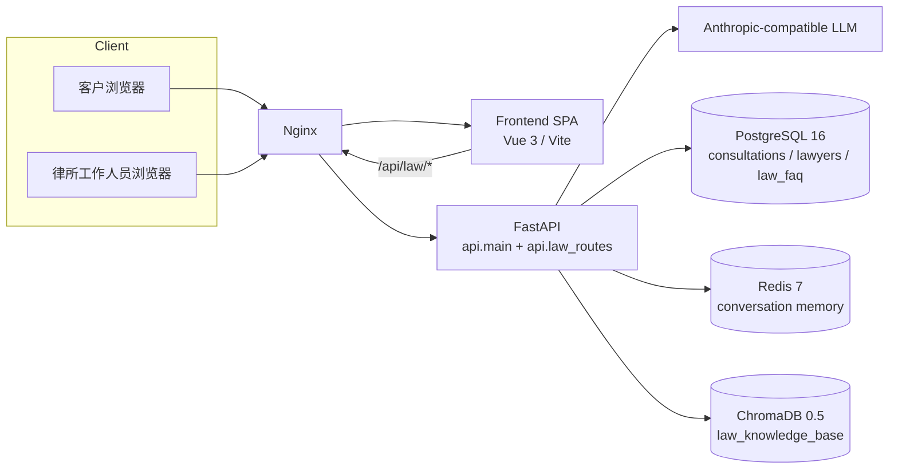
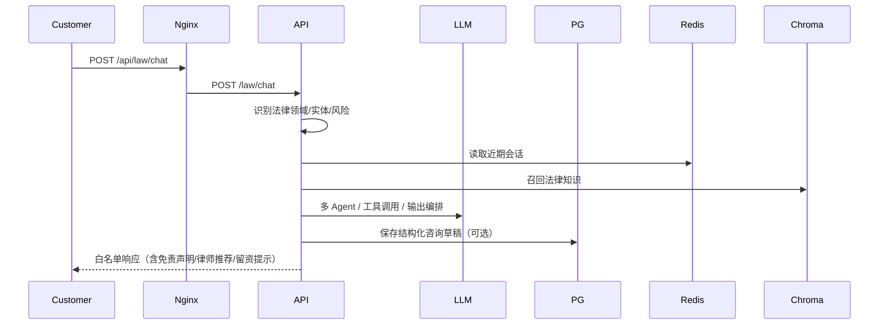
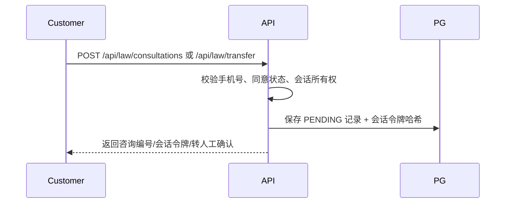
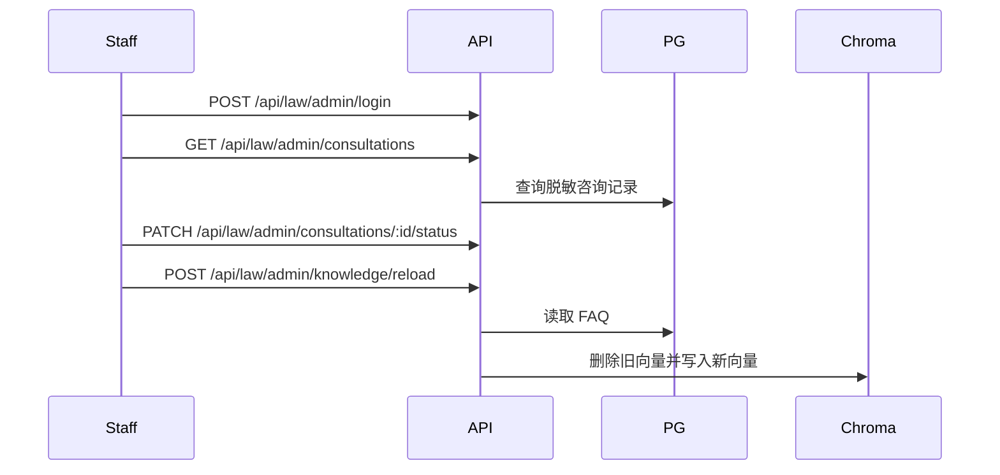

# LawMind Architecture

LawMind 是面向律所对外咨询场景的 Python/FastAPI 多 Agent 系统。本文档描述生产部署结构、请求路径和客户/工作人员流程。

## 系统图

## 部署拓扑

1. `lawmind-nginx` 监听宿主机 80，是唯一外部入口。
2. `lawmind-nginx` 将 `/api/law/*` 代理到 `lawmind-api:8000/law/*`。
3. `lawmind-nginx` 将 `/health`、`/docs`、`/openapi.json` 代理到 API。
4. `/` 和 `/staff` 等 SPA 路由代理到 `lawmind-frontend:80`。
5. API 容器依赖 PostgreSQL、Redis、ChromaDB，并通过健康检查保证启动顺序。

## 请求链路

### 客户咨询

### 客户留资/转人工

### 工作人员

## 后端组件

| 组件 | 职责 |
| --- | --- |
| `core/law_domain.py` | 法律领域、实体、风险规则 |
| `core/intent_recognizer.py` | LawIntentRecognizer：规则锚点 + LLM 语义 + 本地向量相似度的三源融合 |
| `agents/agent_orchestrator.py` | 接待/刑事/民事/升级 Agent 路由、并行、升级 |
| `agents/tools.py` | 知识搜索、缺失事实、咨询记录、律师推荐、交接工具 |
| `memory/` | Redis 近期消息 + ChromaDB 用户/案件记忆 |
| `mcp/` | `law_knowledge_base` 向量集合与工具注册 |
| `db/` | PostgreSQL/SQLite session、ORM、Repository |
| `services/` | 会话身份、咨询、律师、FAQ 同步、引导 |
| `evaluation/evaluator.py` | 意图评测、LLM Judge 与基线 |
| `monitor/` | 性能监控、Prometheus |

## 数据与搜索

- 意图识别默认在存在有效模型配置时启用「LLM 语义 + 本地 n-gram 向量相似度 + 规则锚点」三源融合；无有效配置时自动回退纯规则，保证可测试与确定性。
- PostgreSQL 是咨询、律师、FAQ 的事实源。
- FAQ 修改后由 `faq_sync_service` 同步到 ChromaDB；旧向量先删除，避免残留。
- ChromaDB 只保存 `law_knowledge_base` 集合，包含领域摘要和 FAQ 向量，不按 Agent 拆分。
- Redis 用于短期会话上下文；ChromaDB 用于长期记忆/检索。
- 本地/测试默认可使用 SQLite；Docker Compose 使用 PostgreSQL 作为事实源。

## 评测基线

- `backend/data/eval/law_baseline.json` 是仓库归档基线，只读。
- `backend/data/eval/runtime_law_baseline.json` 是运行时基线，由 `EndToEndEvaluator.run()` 生成/更新。
- 默认运行时路径可由 `EVAL_BASELINE_PATH` 覆盖；归档基线可由 `EVAL_SHIPPED_BASELINE_PATH` 覆盖，仅用于首次对比。
- 运行时基线缺失时，系统会读取归档基线进行对比；任何评测运行都不会覆写归档基线。

## 客户流程

1. 打开 `/`。
2. 输入问题或使用快捷标签。
3. API 返回法律领域、风险信号和缺失关键事实。
4. 展示初步风险分析、律师推荐和免责声明。
5. 客户可提交留资或转人工；系统要求同意联系并校验手机号。
6. 后续由律所工作人员在 `/staff` 查看和跟进。

## 工作人员流程

1. 打开 `/staff`。
2. 输入 `LAWMIND_ADMIN_PASSWORD`。
3. 查看咨询记录列表（联系方式默认脱敏）。
4. 更新状态、管理律师、管理 FAQ。
5. 在知识库/监控页触发 FAQ 同步并查看概览。

## 安全边界

- 生产外部入口仅为 Nginx 80 端口；`docker-compose.yml` 映射的 PostgreSQL `5433`、Redis `6379`、ChromaDB `8003` 仅用于本机调试，不作为生产暴露端口。生产环境应移除这些宿主机端口映射或限制访问来源。
- `/api/law/chat` 使用响应白名单，不暴露 Agent、工具、实体或联系方式。
- 工作人员接口使用 `X-Admin-Password`。
- 会话身份依赖 `LAWMIND_SESSION_SECRET`，数据库只保存令牌哈希。
- PII 最小化：仅收集同意后的联系人信息，列表和日志脱敏。
- 所有对外法律回答必须保留“不构成正式法律意见”边界。
