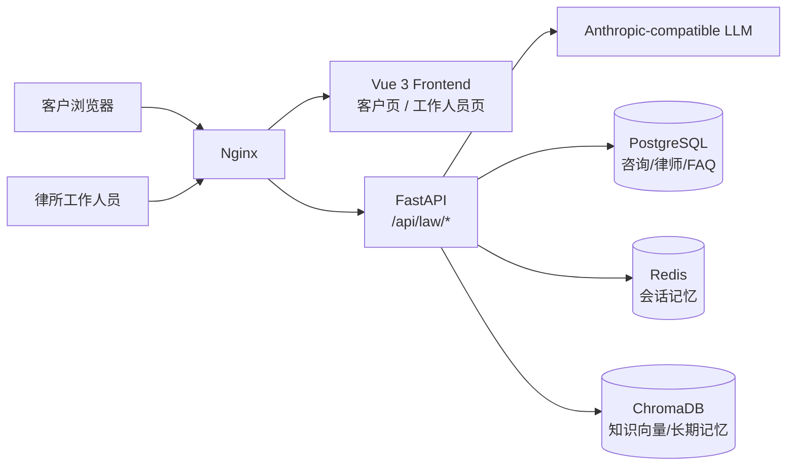
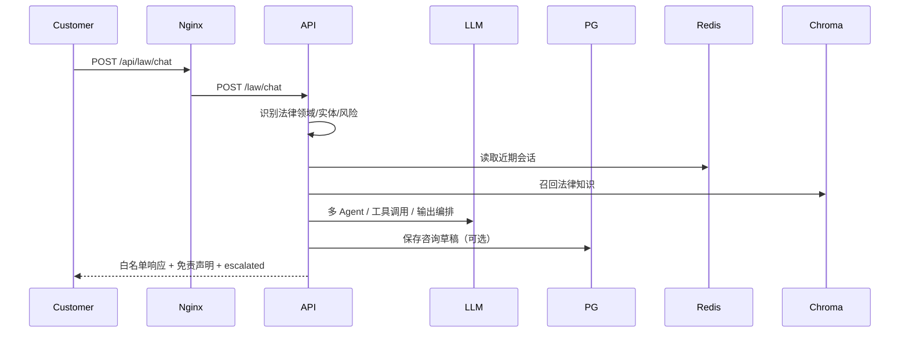
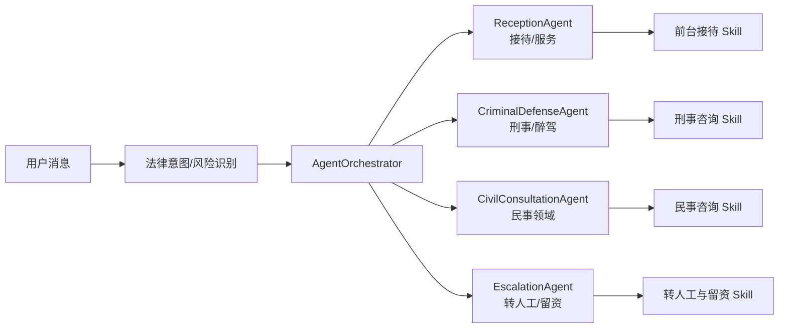
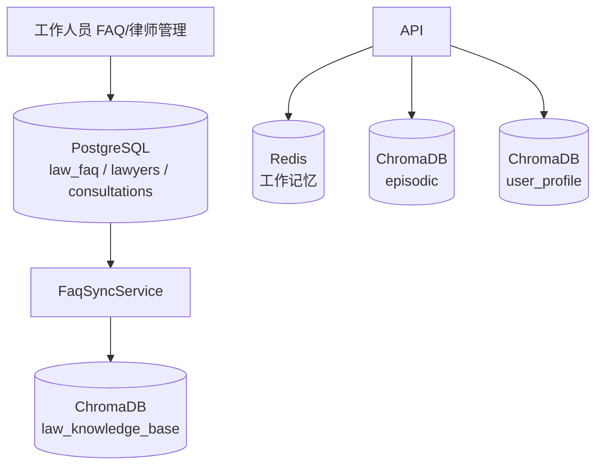
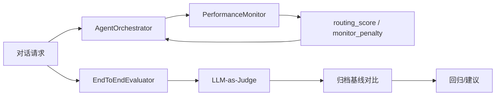
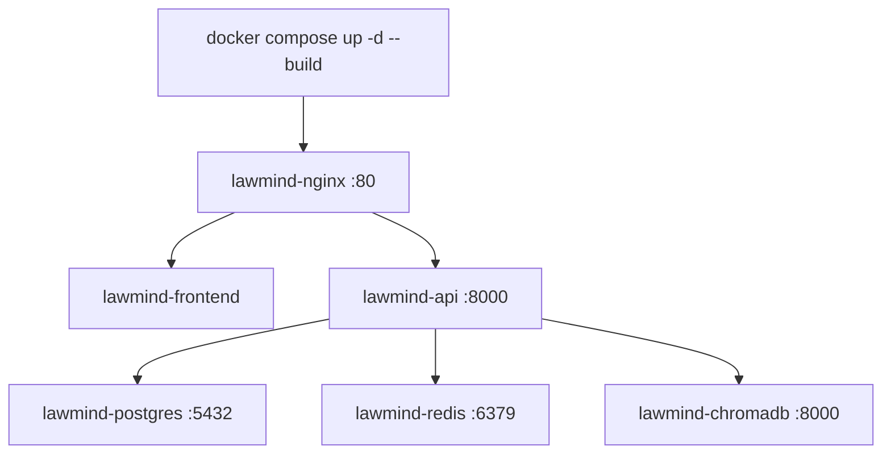

# LawMind 架构图

本文档展示 LawMind 的核心架构。所有图都可以用 Mermaid 在支持的 Markdown 阅读器中渲染；仓库另有 `wiki/assets/architecture/` 下的 SVG 版本。

## 1. 总体架构

## 2. `/api/law/chat` 主链路

## 3. 多 Agent 与 Skills

## 4. 数据与存储

## 5. 监控与评测

## 6. Docker Compose 部署

## 7. 图片资产

`wiki/assets/architecture/` 下提供了与本文对应的简化 SVG 版本。

- `01-overall-architecture.svg`
- `02-chat-flow.svg`
- `03-agent-skills.svg`
- `04-data-storage.svg`
- `05-monitor-eval.svg`
- `06-deployment.svg`
